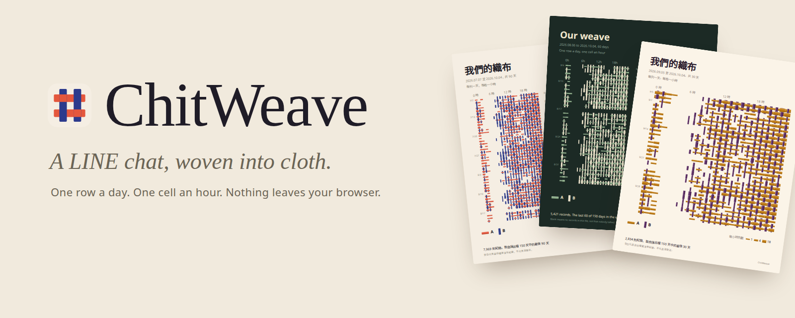
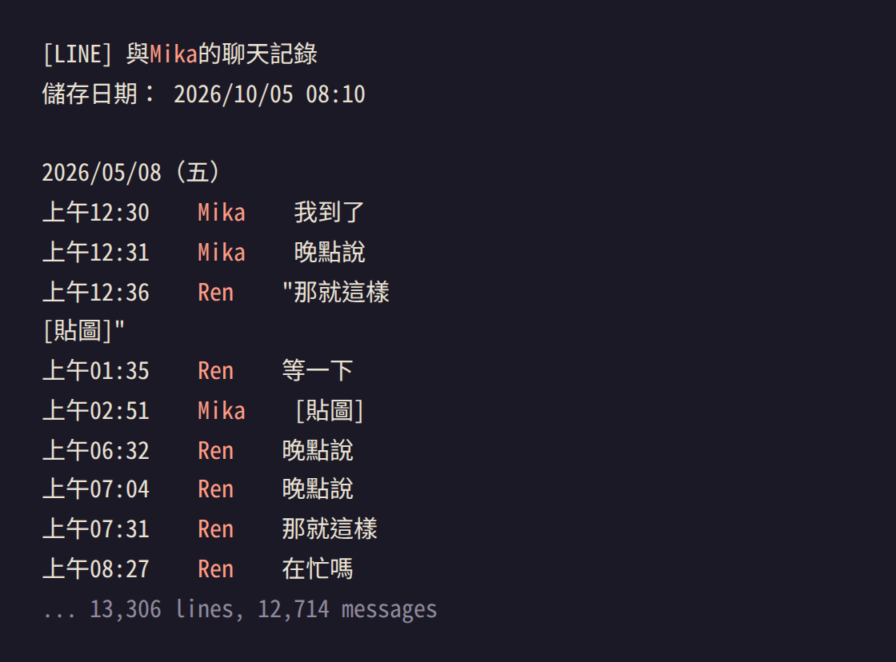
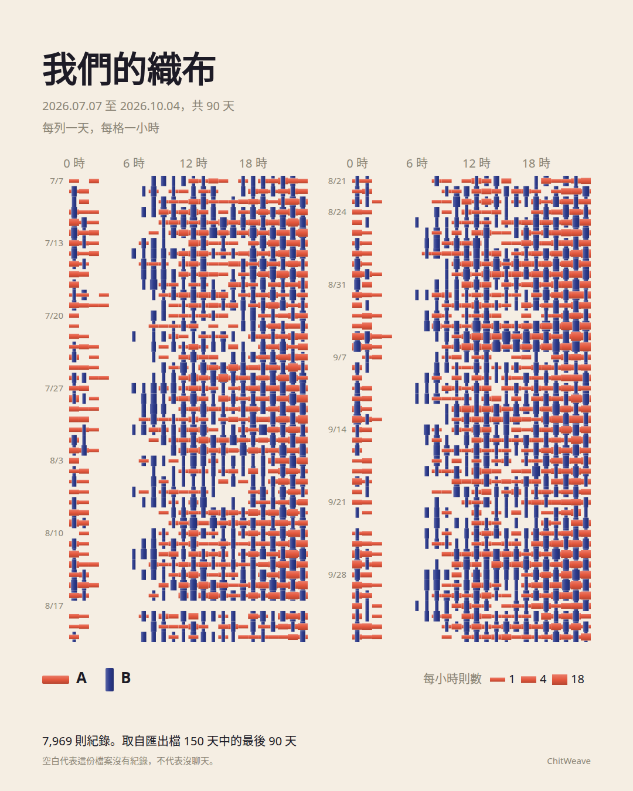
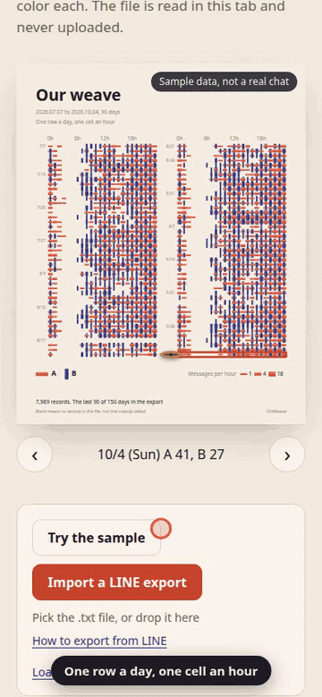
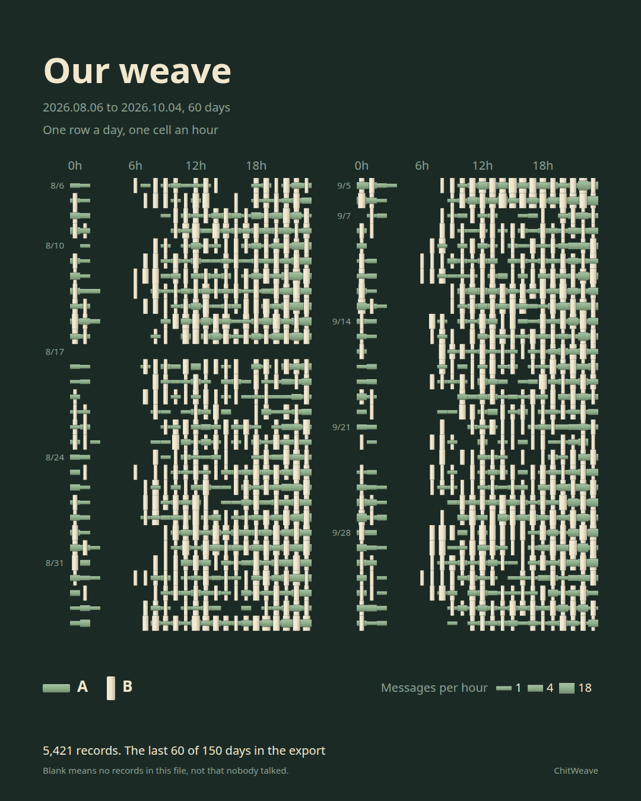
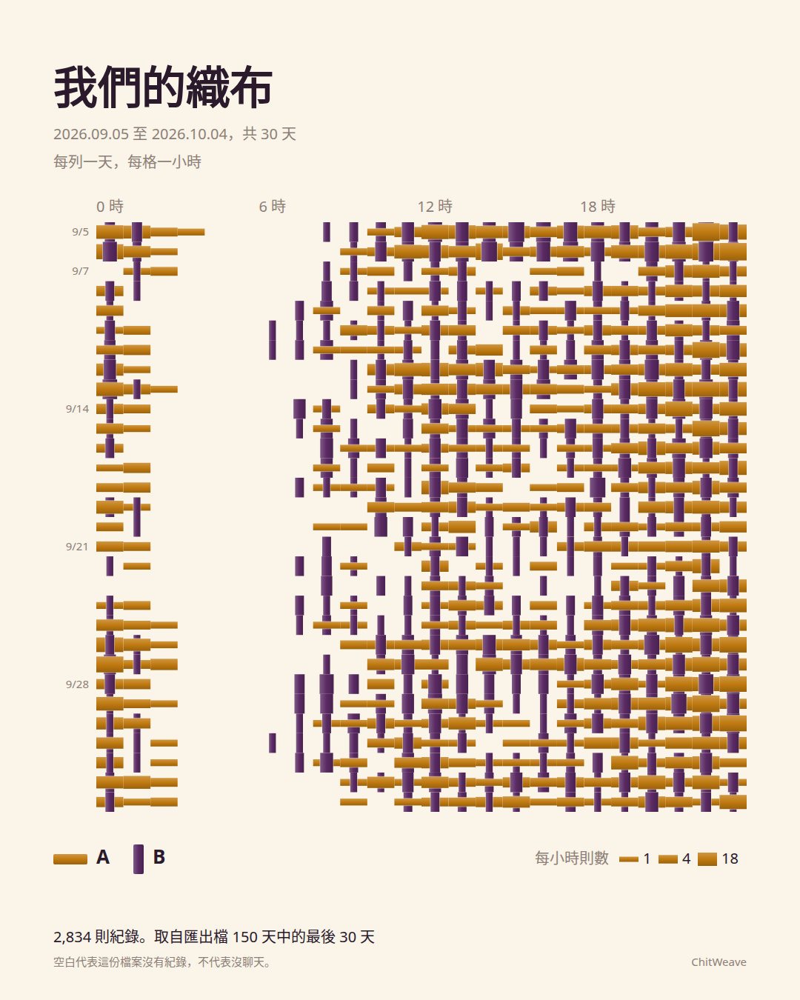
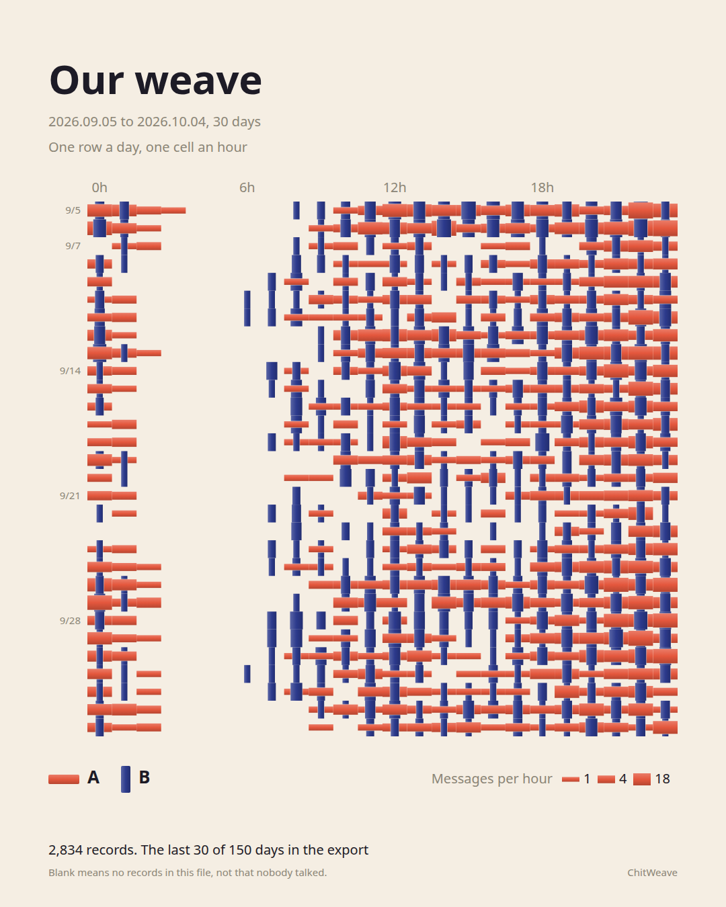
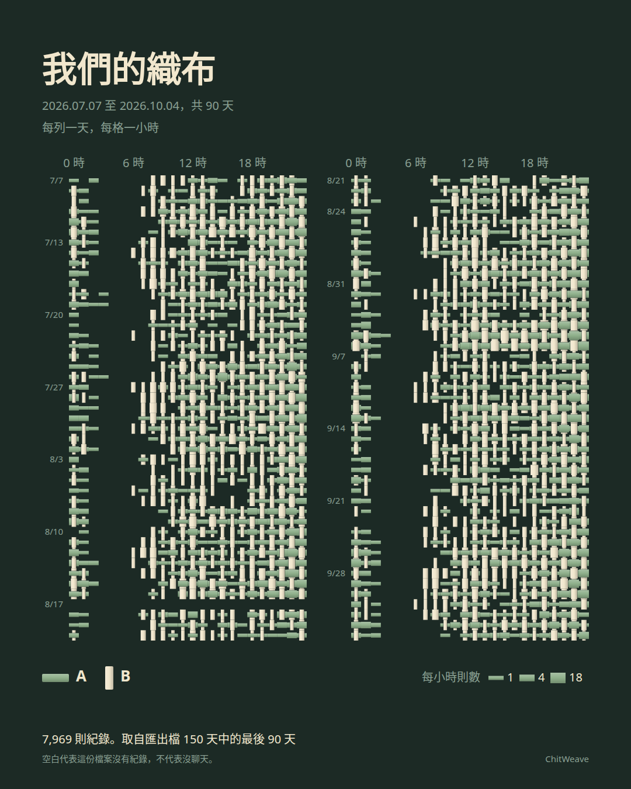
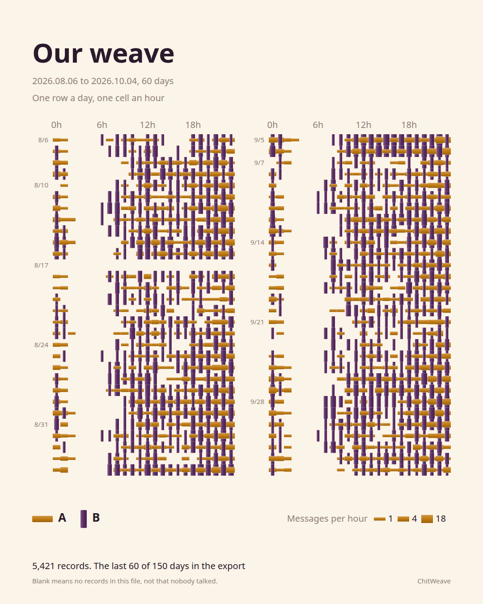

<p align="center">
  <picture>
    <source media="(prefers-color-scheme: dark)" srcset="assets/hero-dark.png">
    
  </picture>
</p>

# ChitWeave

**Turn a two-person LINE chat export into a woven picture of when the two of you talk. It runs in your browser and nothing is uploaded.**

**12,714 messages counted in 5 ms, on the page in 46 ms, 0 requests sent.**
<sub>Measured by `npm run verify` on a made-up 150-day export. Counting time is the median of 25 runs in Node 24. Page time is the median of 5 imports in headless Chromium, from choosing the file until the new weave is in the page. The 1.5 second weaving animation comes after that and isn't counted. Requests are everything the page asked the network for after it loaded, counted by Playwright. Your machine will differ.</sub>

[Open the live page](https://arthur031221.github.io/ChitWeave/) | [Aggregate format](docs/AGGREGATE_FORMAT.md) | [Export layouts](docs/LINE_FORMATS.md) | [Contributing](CONTRIBUTING.md)

> [!TIP]
> No chat to hand? Weave the made-up sample from a terminal:
> ```sh
> npx github:Arthur031221/ChitWeave --sample -o weave.svg
> ```

Not a chat statistics dashboard. One row for each day, one cell for each hour, a thread for each of you.

<table>
<tr><th align="left">Before: the file LINE gives you</th><th align="left">After: the same file in ChitWeave</th></tr>
<tr>
<td valign="top"></td>
<td><a href="assets/gallery/coral-90-zh.png"></a></td>
</tr>
</table>

<p align="center">
  
</p>

## What you do with it

1. Open the page and look at the sample. It's a made-up chat and says so. The page opens in Traditional Chinese or English, depending on your browser, and has a switch.
2. In LINE, open a two-person chat and export it as text ([LINE's help page](https://help.line.me/line/?contentId=20007388&lang=zh-Hant)). Pick that `.txt` file in the page, or drop it on the page.
3. Drag the shuttle down the cloth to read any day. Pick a color, a range, two nicknames.
4. Save the picture. It's a 1080 by 1350 PNG, or an SVG if you want to edit it.

The picture never shows a message or a sender name. Nicknames are whatever you type. Out of the box the two of you are A and B.

## Gallery

<table>
<tr>
<td width="33%"><a href="assets/gallery/coral-90-zh.png"></a><br><sub><i>Coral and indigo, 90 days. More than a month folds into two panels so the threads stay big enough to read.</i></sub></td>
<td width="33%"><a href="assets/gallery/sage-60-en.png"></a><br><sub><i>Sage and cream, 60 days. The blank band is the night. The thin gap in the left panel is a day nobody wrote.</i></sub></td>
<td width="33%"><a href="assets/gallery/amber-30-zh.png"></a><br><sub><i>Amber and plum, 30 days. One panel, fat threads, easiest to read.</i></sub></td>
</tr>
<tr>
<td><a href="assets/gallery/coral-30-en.png"></a><br><sub><i>The text on the picture follows the page language, Traditional Chinese or English.</i></sub></td>
<td><a href="assets/gallery/sage-90-zh.png"></a><br><sub><i>The same 90 days in sage and cream.</i></sub></td>
<td><a href="assets/gallery/amber-60-en.png"></a><br><sub><i>Amber and plum, 60 days.</i></sub></td>
</tr>
</table>

Every picture here comes from the same made-up chat. None of it is a real conversation.

## Why I built it

I wanted something to give to a person. A dashboard about them isn't that. A chat export is thirteen thousand lines of text and tells you nothing at a glance. The rhythm of two people is in the timing: who is up at midnight, who writes on the train, the week it went quiet.

> *The picture knows how often you talked. It never knows what you said.*

So the tool counts and throws the text away. The renderer only ever sees a small table of counts per day and hour, which is also the file format, so it can weave counts from any source. I think that's the honest way to make a keepsake from a private conversation.

## What it makes

| Output | How | What is in it |
| --- | --- | --- |
| A 1080 by 1350 PNG | "Save picture" in the page | Counts, your title and nicknames, the date range, a legend, how much of the export it covers |
| The same picture as SVG | "Save SVG", or `npx github:Arthur031221/ChitWeave chat.txt` | The same, as vector shapes you can open in any editor |
| Aggregate JSON | `npx github:Arthur031221/ChitWeave chat.txt --json` | Counts per day and hour for two people. No names, no text. [Format](docs/AGGREGATE_FORMAT.md) |

## How it reads a chat

The same four steps run in the page and in the command line.

```text
  chat.txt  ->  counts per day and hour  ->  layout  ->  SVG  ->  PNG
  parse.js      aggregate.js                 layout.js   svg.js   canvas, in the page
```

- **One record is one message.** A message that wraps over several lines counts once. Lines with no sender, such as notices, are skipped. Stickers and photos count, because they're messages.
- **Thickness follows `log1p(count) / log1p(max)`.** The maximum is the busiest single cell of either person in the range, so one scale covers both. Threads run from a fifth of the widest to the widest. A cell with no records has no thread.
- **Threads cross like a plain weave.** Your thread runs along the row, theirs down the column, and at each crossing one lies on top, alternating.
- **Anything it cannot trust is left out and reported.** A date line whose weekday doesn't match or whose layout it doesn't read, a time like 25:00, or a quote that never closes counts as nothing and is reported with its line number. The page shows the first five and the total. It never guesses.
- **Quoted messages stay whole.** A message that opens a double quote runs until the quote closes, so a pasted line that looks like a record inside it isn't read as one. A real date line inside a quote ends it, so one stray quote can't swallow the rest of the file.
- **The first sender in the file is thread A.** There's a Swap button. Two people are told apart by display name only, and a group chat is refused by its header.

## Install

<details>
<summary>In the browser (nothing to install)</summary>

Open <https://arthur031221.github.io/ChitWeave/>. Or save `dist/index.html` from this repository and open it from your disk. It's one file with the fonts inside and works offline.
</details>

<details>
<summary>Command line (Node 20 or newer)</summary>

```sh
npx github:Arthur031221/ChitWeave chat.txt -o weave.svg
npx github:Arthur031221/ChitWeave chat.txt --days 30 --palette sage --a Mika --b Ren --title "Spring"
npx github:Arthur031221/ChitWeave --help
```

It reads the export, prints how many records it found and which lines it skipped, and writes an SVG. Names are used for labels only when you pass `--a` and `--b`.
</details>

<details>
<summary>Host it yourself</summary>

```sh
git clone https://github.com/Arthur031221/ChitWeave
cd ChitWeave && npm ci && npm run build
```

`dist/index.html` is the whole site. Put it on any static host. The Content Security Policy is inside the file, so it doesn't depend on server headers.
</details>

<details>
<summary>Develop</summary>

```sh
npm test                     # 57 unit tests: parser, aggregate, layout, picture, command line
npx playwright install chromium firefox
npm run test:e2e             # 22 browser tests, BROWSER=firefox for the other one
npm run verify               # measures the numbers at the top of this page
```

See [CONTRIBUTING.md](CONTRIBUTING.md).
</details>

## What I checked, and what I did not

- **Nothing is uploaded.** The page ships with a policy that blocks every outgoing request. A test confirms a `fetch` from the page is refused and that importing a file and saving both cause zero requests. The only links that leave the page are the ones you click.
- **The saved picture holds no message text.** A test imports a chat whose messages and sender names are marked strings and checks that the saved SVG has none of them and that the PNG has no metadata chunks.
- **The counts are right for the files I could make.** The parser counts a 12,714 message made-up export and the result is compared with the numbers the text was written from. It's also checked against hand-counted excerpts and against 24 hour and dotted date variants.
- **I haven't run it on a fresh export from every phone.** The layouts it reads come from public LINE analyzers and are written down in [docs/LINE_FORMATS.md](docs/LINE_FORMATS.md). If your file is refused, the page prints the line numbers. Open an issue with the first five lines, names and text replaced.
- **Tested in Chromium and Firefox, with a phone-sized emulated screen.** I haven't tried Safari.
- **A blank cell means no record in this file.** Exports can be partial, and the picture says so at the bottom.

## Planned

Group chats. More export layouts. An installable offline version. A real Safari pass.

## Credits

LINE's export layout is documented by other people's analyzers, [chonyy/line-message-analyzer](https://github.com/chonyy/line-message-analyzer) and [EpochME/chatlab](https://github.com/EpochME/chatlab). I read their formats and wrote my own parser. The page headings use [Instrument Serif](THIRD_PARTY.md). ChitWeave isn't affiliated with LINE.

MIT licensed. See [LICENSE](LICENSE).
